# Visual Souvenir Full Image Asset Pipeline Design

## Completion decision

Complete as a future asset pipeline design. The current product must keep `/visual-souvenir/preview` no-image/no-persistence. Real image generation should be a separate implementation task after privacy, storage, deletion, and prompt-sidecar contracts are approved.

## Existing evidence inspected

- `docs/IMAGE_ASSETS_SPEC.md`: generated deliverable images must be copied into repository/project asset paths and have prompt sidecars with dimensions and SHA-256.
- `.trellis/spec/frontend/image-asset-guidelines.md`: `.codex/generated_images`, temp folders, downloads, and chat previews are not deliverable asset paths.
- `.trellis/spec/backend/visual-souvenir-preview-contract.md`: current backend returns `image_generated=false`, `requires_confirmation=true`, and no files.
- `.trellis/spec/frontend/visual-souvenir-preview-boundary.md`: UI must treat the response as prompt preview and not claim an image exists.
- `backend/src/fablemap_api/core/visual_souvenir.py` and `frontend/app/lib/taverns.ts`: existing preview helpers already separate prompt preview from future generation.

## Future pipeline

```mermaid
flowchart LR
  A[Observable tavern moment] --> B[No-image prompt preview]
  B --> C[Owner/visitor review and explicit confirmation]
  C --> D[Generation adapter]
  D --> E[Privacy/moderation check]
  E --> F[Project or owner asset storage]
  F --> G[Prompt sidecar with hash/dimensions]
  G --> H[Reference URL returned]
  H --> I[Retention/delete controls]
```

## Required contracts before implementation

- Identity: non-owner visitors may only generate from their own observable moment; owner access must be explicit.
- Privacy: redact visitor ids, contact data, exact private addresses, hidden prompts, and private owner data before generation.
- Cost: no automatic generation on page load; explicit confirmation and owner/provider cost messaging.
- Storage: generated files are not complete until stored in a project/owner asset path and referenced by served URL/import path.
- Provenance: same-directory prompt sidecar with prompt type, dimensions, SHA-256, negative constraints, style source, and updated time.
- Retention/delete: owner and affected visitor must have a clear deletion path before persistent sharing.
- Public sharing: disabled by default; no discovery-card reuse until explicitly approved.

## Deferred implementation

No generation endpoint, file storage schema, public sharing UI, or image asset was added in this task. If implemented later, update backend/frontend contracts, tests, `docs/IMAGE_ASSETS_SPEC.md` if needed, and run build plus asset validation.

## Verification

Documentation-only completion plus existing code/spec inspection. No `.codex/generated_images` output was produced by this task.
